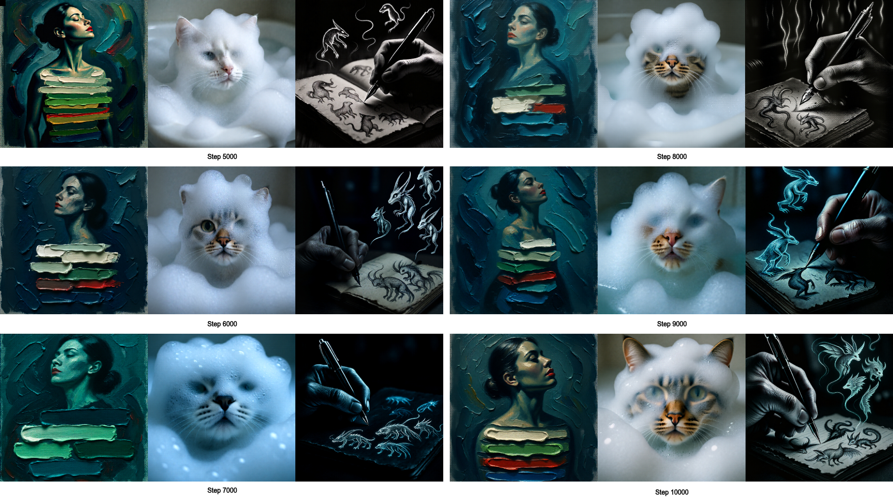

<h1 align="center"><sub><sup>TwinFlow with Latent-Space RL (An Experiment)</sup></sub></h1>
<p align="center">
  TwinFlow Authors (I'm in no way associated with the authors of the original method)
  <br>
  <a href="https://zhenglin-cheng.com/" target="_blank">Zhenglin&nbsp;Cheng</a><sup>*</sup> &ensp; <b>&middot;</b> &ensp;
  <a href="https://scholar.google.com/citations?user=-8XvRRIAAAAJ" target="_blank">Peng&nbsp;Sun</a><sup>*</sup> &ensp; <b>&middot;</b> &ensp;
  <a href="https://sites.google.com/site/leeplus/" target="_blank">Jianguo&nbsp;Li</a> &ensp; <b>&middot;</b> &ensp;
  <a href="https://lins-lab.github.io/" target="_blank">Tao&nbsp;Lin</a>
</p>
<div align="center">
  
  <p style="margin-top: 8px; font-size: 14px; color: #666; font-weight: bold;">
    8-NFE visualization of RL-Guided-TwinFlow-Qwen-Image-2512 across multiple checkpoints
  </p>
</div>


## 📖 Citation

```bibtex
@article{cheng2025twinflow,
  title={TwinFlow: Realizing One-step Generation on Large Models with Self-adversarial Flows},
  author={Cheng, Zhenglin and Sun, Peng and Li, Jianguo and Lin, Tao},
  journal={arXiv preprint arXiv:2512.05150},
  year={2025}
}

@misc{sun2025anystep,
  author = {Sun, Peng and Lin, Tao},
  note   = {GitHub repository},
  title  = {Any-step Generation via N-th Order Recursive Consistent Velocity Field Estimation},
  url    = {https://github.com/LINs-lab/RCGM},
  year   = {2025}
}

@article{sun2025unified,
  title = {Unified continuous generative models},
  author = {Sun, Peng and Jiang, Yi and Lin, Tao},
  journal = {arXiv preprint arXiv:2505.07447},
  year = {2025},
  url = {https://arxiv.org/abs/2505.07447},
  archiveprefix = {arXiv},
  eprint = {2505.07447},
  primaryclass = {cs.LG}
}
```

## Acknowledgement

TwinFlow is built upon [RCGM](https://github.com/LINs-lab/RCGM) and [UCGM](https://github.com/LINs-lab/UCGM), with much support from [InclusionAI](https://github.com/inclusionAI).

Note: The [LINs Lab](https://lins-lab.github.io/) has openings for PhD students for the Fall 2026/2027 intake. Interested candidates are encouraged to reach out.

If you want to checkout the checkpoints from the RL guided method [RL guided TwinFlow](https://huggingface.co/shauray/temp-ckpts-twinflow).

For more details go through this blog : [Enhancing TwinFlow with Latent-Space RL and Dynamic Noise Scheduling for Qwen-Image-2512](https://shauray8.github.io/about_shauray/blogs/qwen_twinflow.html)
